

<picture><source media="(prefers-color-scheme: dark)" srcset="./assets/header-dark.svg">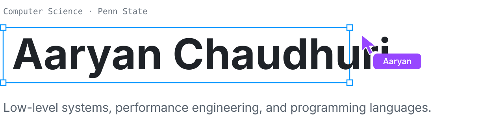</picture>

  <samp>
    <a href="mailto:chaudhuri.aaryan@gmail.com">email</a> ·
    <a href="https://www.linkedin.com/in/aaryan-chaudhuri-9041a2286/">linkedin</a>
  </samp>

 

<picture><source media="(prefers-color-scheme: dark)" srcset="./assets/intro-dark.svg">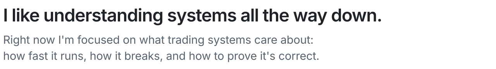</picture>

 

<picture><source media="(prefers-color-scheme: dark)" srcset="./assets/s-projects-dark.svg">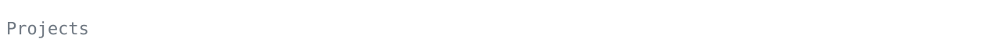</picture> 
<a href="https://github.com/AaryanC/8Bitcomputer"><picture><source media="(prefers-color-scheme: dark)" srcset="./assets/p-8bit-dark.svg">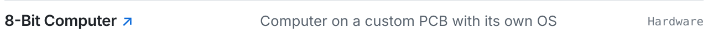</picture></a> 
<a href="https://github.com/AaryanC/Schism_Final"><picture><source media="(prefers-color-scheme: dark)" srcset="./assets/p-schism-dark.svg">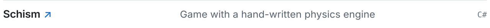</picture></a> 
<a href="https://github.com/AaryanC/OIS_FRC_TechnoLeopards_2023-2024"><picture><source media="(prefers-color-scheme: dark)" srcset="./assets/p-frc-dark.svg">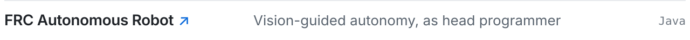</picture></a> 
<picture><source media="(prefers-color-scheme: dark)" srcset="./assets/p-stray9-dark.svg">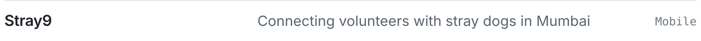</picture> 
<picture><source media="(prefers-color-scheme: dark)" srcset="./assets/p-steth-dark.svg"></picture> 
<picture><source media="(prefers-color-scheme: dark)" srcset="./assets/p-wharton-dark.svg"></picture> 
<picture><source media="(prefers-color-scheme: dark)" srcset="./assets/p-uber-dark.svg"></picture>

 

<picture><source media="(prefers-color-scheme: dark)" srcset="./assets/s-progress-dark.svg">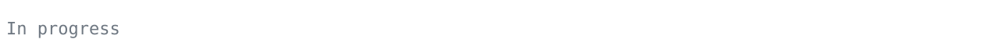</picture> 
<picture><source media="(prefers-color-scheme: dark)" srcset="./assets/w-engine-dark.svg">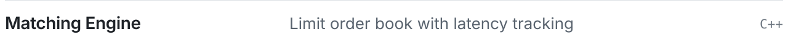</picture> 
<picture><source media="(prefers-color-scheme: dark)" srcset="./assets/w-queue-dark.svg">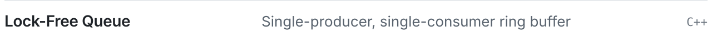</picture> 
<picture><source media="(prefers-color-scheme: dark)" srcset="./assets/w-miniml-dark.svg">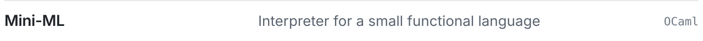</picture> 
<picture><source media="(prefers-color-scheme: dark)" srcset="./assets/w-mm-dark.svg"></picture>

 

<picture><source media="(prefers-color-scheme: dark)" srcset="./assets/s-recog-dark.svg"></picture> 
<picture><source media="(prefers-color-scheme: dark)" srcset="./assets/r-aime-dark.svg">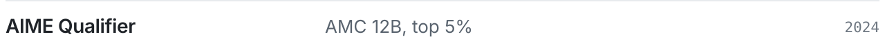</picture> 
<picture><source media="(prefers-color-scheme: dark)" srcset="./assets/r-first-dark.svg"></picture>

 

<picture><source media="(prefers-color-scheme: dark)" srcset="./assets/langs-dark.svg">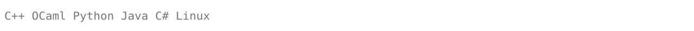</picture>

